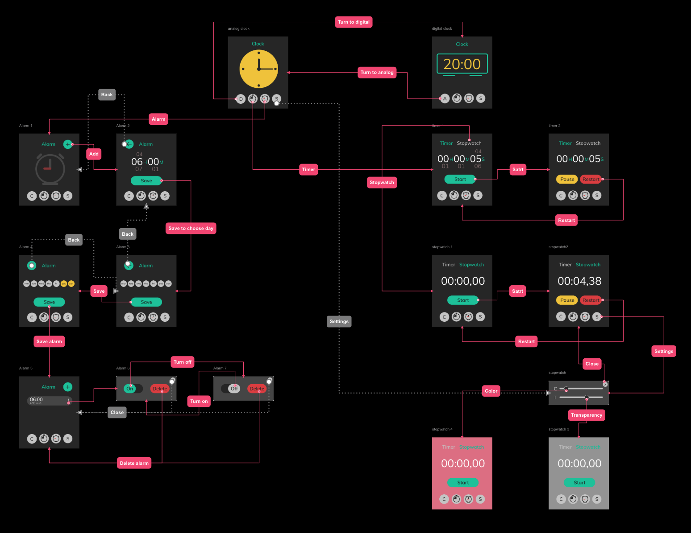
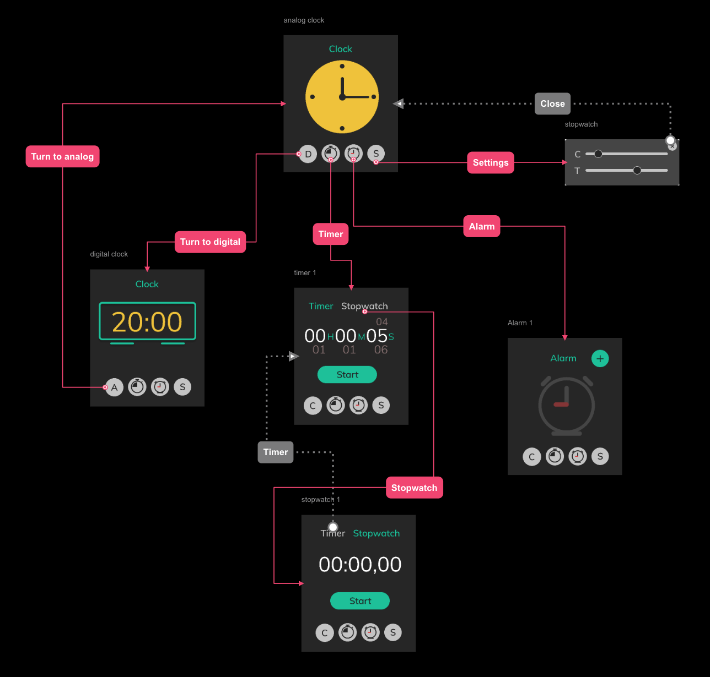
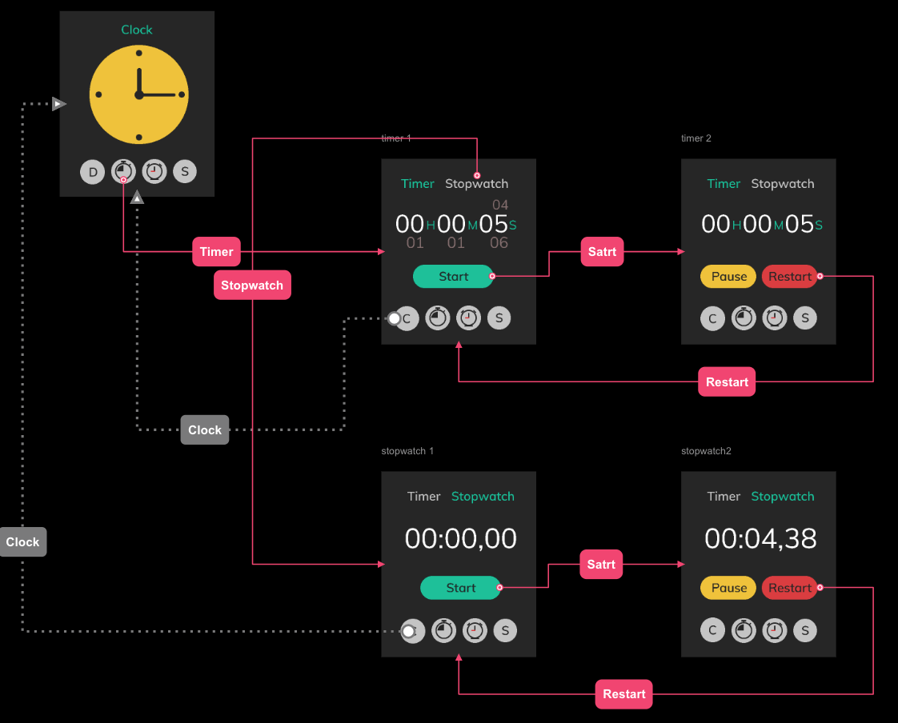
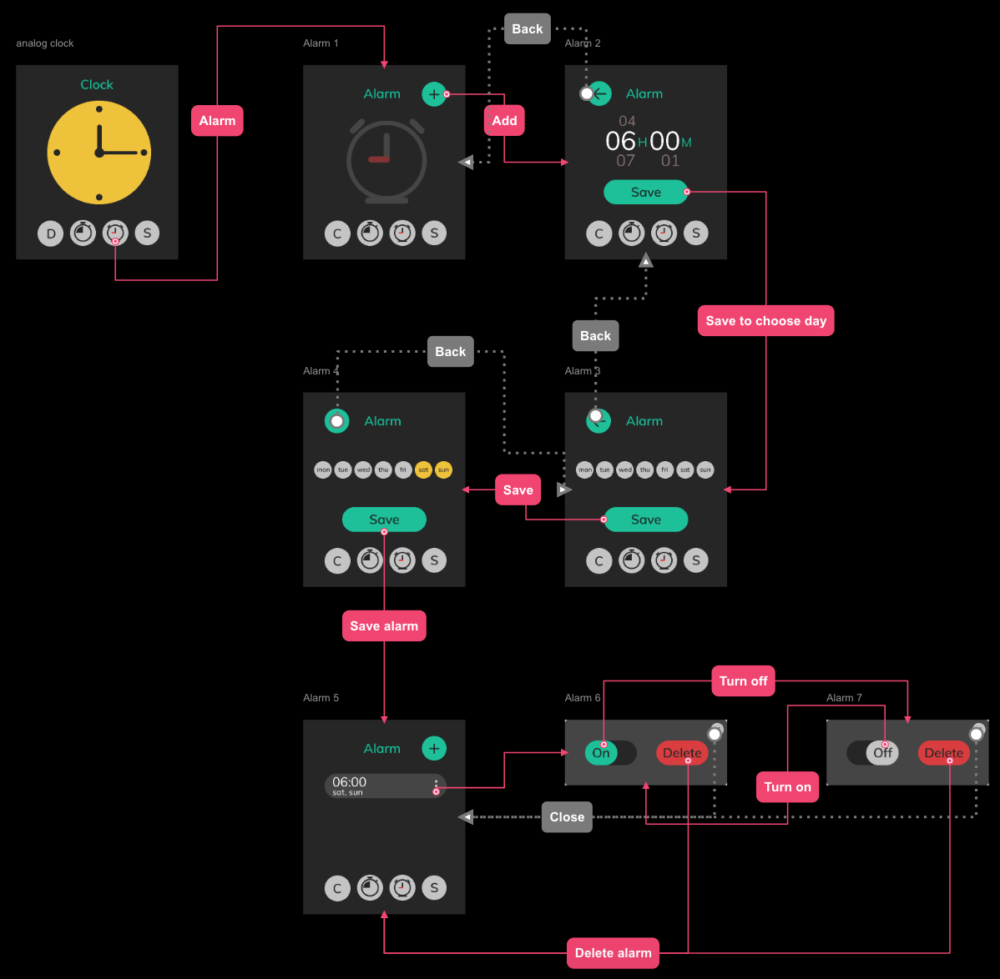
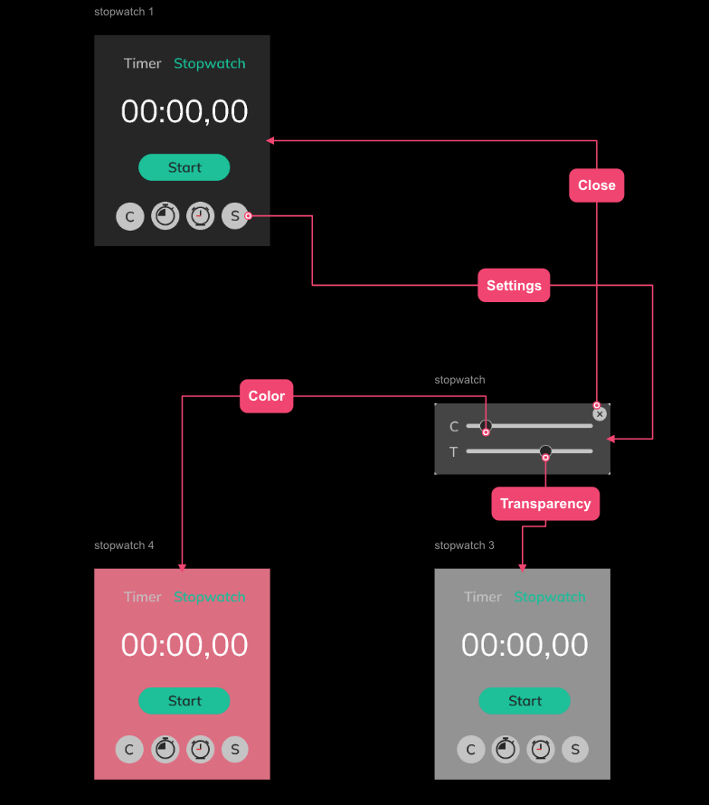

# UX-user-flow-clock-app
UX user flow for clock application

To create user flow i used the prototyping tool [Overflow](https://overflow.io) 

Map of user flow for Clock application

Main window

Timer and stopwatch

Alarm

Settings
